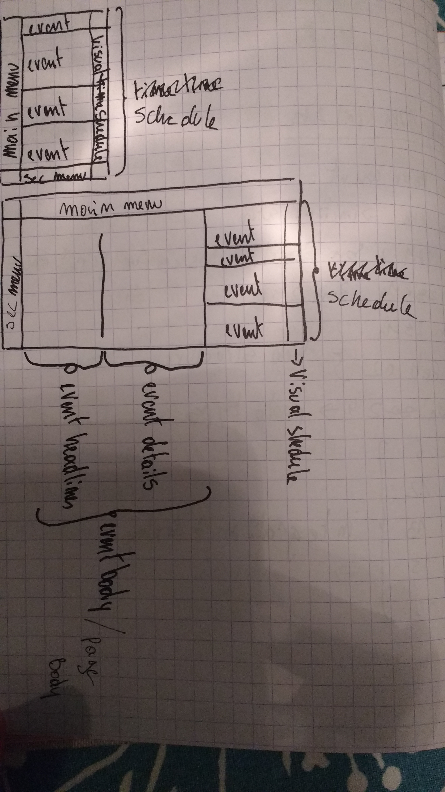

# Element naming for website:

* main menu: contains main home button and links to pages
  * on mobile, main menu takes up all of the height of the left screen
  * on desktop, main menu covers all of the width of the top screen
* secondary-menu: contains search bar, a map shortcut, facebook shortcut
  * on mobile, secondary-menu is a pull up item from the bottom of the screen
  * on desktop, secondary-menu takes up all of the height of the left screen
* shedule: contains the list of events
  * event: one item out of timeline
  * (visual) timeline: a visualisation of the season that plots out different graphical elements for each event category
* event body / page body: the remaining space that is not taken up by timelines or menus
  * event headlines is half of the event body space on desktop, where the headlines of the detail are reminded, title, author, dates, hours, main image. **This will also be the space for updates if an event is changed publicly**
  * event details: contains the body of the event litterature: paragraphs, videos, research
